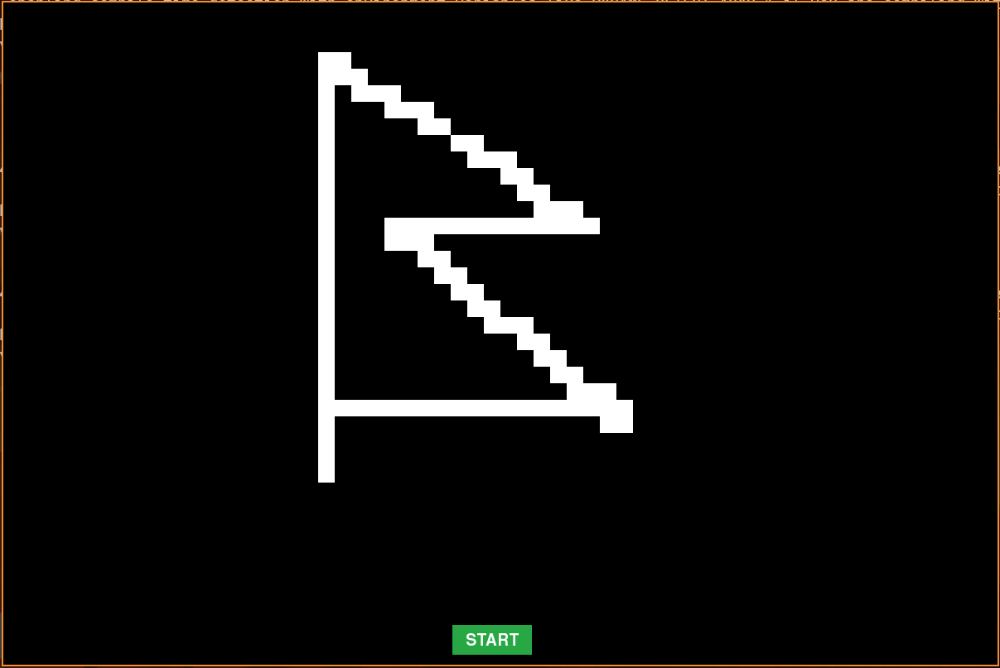
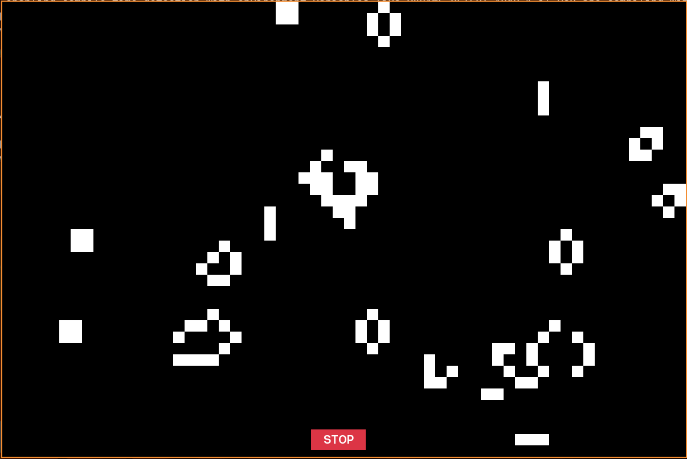

# Game of Life

A Python implementation of Conway's Game of Life with a graphical interface using Pygame. This project allows users to interactively create, start, and stop cellular automata simulations, featuring classic patterns and customizable grid settings.

## Features

- Interactive grid for drawing and erasing cells
- Start/Stop button to control simulation
- Predefined patterns (glider, blinker, block, etc.)
- Adjustable simulation speed
- Clean, modular code structure

## Project Structure

```
game-of-life/
├── src/
│   ├── button.py         # UI button for start/stop
│   ├── config.py         # Configuration constants and enums
│   ├── game.py           # Main game loop and window
│   ├── game_manager.py   # Handles game state and user input
│   ├── life.py           # Organism (cell) logic
│   ├── patterns.py       # Predefined Game of Life patterns
│   ├── renderer.py       # Drawing logic for grid and cells
│   ├── rules.py          # Game of Life rules engine
│   └── __init__.py
├── setup.py
├── pyproject.toml
├── uv.lock
├── LICENSE
├── README.md
└── screenshots/
```

## Installation

1. **Requirements:** Python 3.14+, Pygame 2.6.1+
2. **Install dependencies:**
   ```bash
   pip install .
   ```

## Usage

Run the game with:
```bash
python setup.py
```
- Click on the grid to add/remove cells.
- Press the **START** button to begin the simulation, **STOP** to pause.

## Screenshots





## License

This project is licensed under the MIT License. See [LICENSE](LICENSE) for details.
